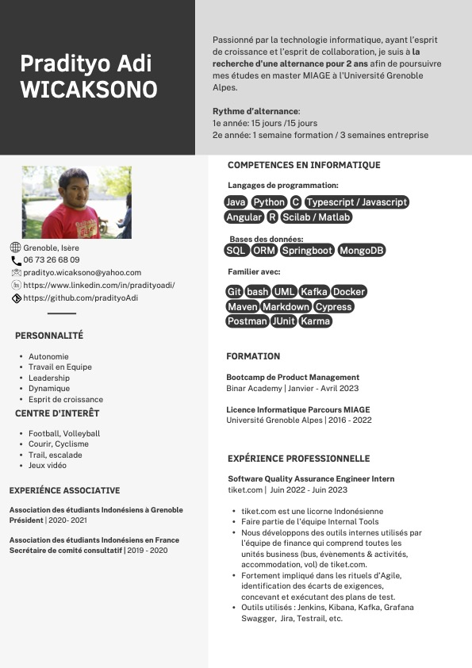

# Hi! I am Adi! 

# I am currently looking for an apprenticeship for my master study 🧑‍💻
 I am a MIAGE student in Université Grenoble Alpes and I am currently looking for an apprenticeship contract in informatics for 2 years starting from September 2023. The rythm from Université Grenoble Alpes is following:
- 1st year: 15 days university & 15 days company
- 2nd year: 1 week university & 3 weeks company
  
Here is my CV in french and you can click this [google drive](https://drive.google.com/drive/folders/15HJVT0XyTOiLeye9a1uwmcXf25rI7g3o?usp=sharing) link to get my CVs both in english and french

# Want to know me better? 🤗📱

[)](https://github.com/pradityoAdi)

## About me
Aspiring to be a tech generalist, I was a software quality assurance in tiket.com, an online travel agency in Indonesia. I worked under Payment vertical, and then moved to the Platform vertical within Internal Tools team. We are developing internal tools developed by finance team that includes all business units of tiket.com including bus, things to do, ferry, accomodation and flight.

Today, I am looking for an opportunity to do an apparenticeship in software engineering as part of my master degree in Université Grenoble Alpes. My strength point is in backend development but I'm not limiting myself to other opportunities. I am also keen to do my apprenticeship as fullstack engineer, data engineer or BI analyst.

## My github profiles
I have a 2nd github profile ([github.com/l3miage-wicaksop](https://github.com/l3miage-wicaksop)) I made during my study in university. This account was utilized to collaborate with fellow students, submit assignments, and work on group projects within the university's coding ecosystem. Having these two separate accounts allows me to effectively manage and differentiate between my personal and academic coding activities, ensuring clarity and organization in both realms.One day, I will merge both of my accounts into one, but for the moment I want to keep it this way.

## My tech stack
I learned about bash, linux, ginx, caddy, VM, GCP from my early days playing video games with my friends. Back then, we rented a vps and a domain, then creating a game server to play together. When I was in high school, I participated in some competitive programming using Pascal.

During university, we learned OOP with Java, network and system courses on C, data analysis and statistics with Python. We also learned database using SQL (Oracle & Postgresql), and NoSQL (MongoDB). In the HMI (human-machine interaction) course, we mainly use Angular on typescript.

Nowadays, I am currently learning to develop on Golang and micro-services architecture. I am also trying to deepen my knowledge on front-end development.

## My personal life
Having been born with a moderate hearing impairment and adopting a hearing aid at the age of 20, I have faced the challenges of adjusting to this new reality, but today I am fully prepared to embrace my journey and leverage my experiences to support and empower others.

Despite my hearing disability, I have been able to excel in my domain and cultivate valuable leadership experiences. While my hearing impairment presents unique challenges, it has never hindered my determination or passion for success. I have developed various strategies and adapted communication methods to ensure effective collaboration with colleagues and team members. Through perseverance and a proactive approach, I have not only overcome barriers but also thrived in my field. 

